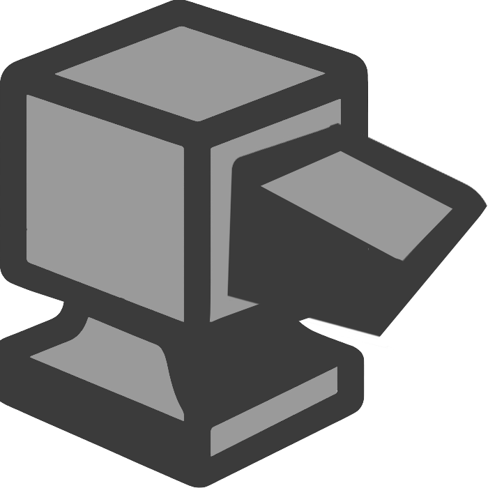

  

<h1 align="center">BLOCKSMITH (FROM FOUND3)</h1>

<blockquote>
  
A Voxel Survival-Sandbox Platform Built On/For Godot.

</blockquote>

THE FOUND3 (Pronounced `The Foundry`) is an open-collective aimed at [BlockSmith](https://github.com/found3/blocksmith) a voxel based survival-sandbox platform and opinionated default 'game' built on it. 

Using the amazing [Godot_Voxel](https://github.com/Zylann/godot_voxel) and a fork of [VoxelGame](https://github.com/Zylann/voxelgame), notably to focus on and extend "Block_Game".

---

You Can View [Jost Grant](https://github.com/jostgrant)'s Personal Knowledgebase / Notes / Ideas For The Project [Here](https://jostgrant.github.io/vault-ice3/index.html)
