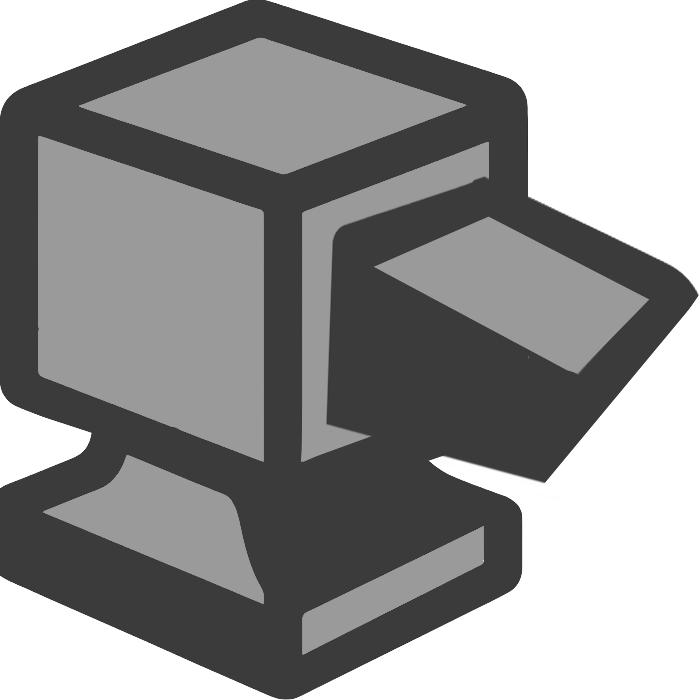

  

<h1 align="center">BLOCKSMITH (FROM FOUND3)</h1>

<blockquote>
  
A Voxel survival-Sandbox Platform Built On/For Godot.

</blockquote>

FOUND3 (Pronounced Foundry) Is An Open Collective / Open GameDev Project To Work On [BlockSmith](https://github.com/found3/blocksmith) a voxel based survival-sandbox platform and opinionated default 'game' built on it. Built on the amazing [Godot_Voxel](https://github.com/Zylann/godot_voxel) and a fork of, to focus on and extend their "Block_Game" via [VoxelGame](https://github.com/Zylann/voxelgame0.
